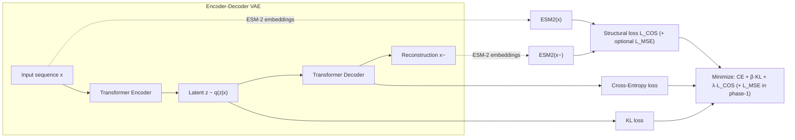

# ESM-VAE

<p align="center">
  <a href="https://doi.org/10.1093/bioinformatics/btzXXX"></a>
  <a href="https://github.com/Ahnd6474/ESM-VAE/blob/main/LICENSE"></a>
  <a href="#"></a>
  <a href="#"></a>
</p>

> **ESM-VAE** (*Evolutionary Scale Modelling VAE*) is a 5.5 M-parameter transformer VAE that learns **structure-aware** latent representations of proteins by aligning reconstructions to **pretrained ESM-2 embeddings** (perceptual loss). It achieves **97.17 %** reconstruction on UniRef50 and strong mutation-effect prediction on ProteinGym (*ρ = 0.689 overall; ρ = 0.7779 for ≤ 512 aa*). Downstream fluorescent-protein tasks reach **0.987** 5-fold accuracy and **2.7/3.8 nm** RMSE for absorption/emission.

> **Note on math rendering:** GitHub Markdown renders LaTeX when you use `$$ ... $$` for display equations and `$ ... $` for inline. Avoid `\[` `\]` wrappers in README.

---

**Table of Contents**

1. [Features](#features)
2. [Method](#method)
3. [ESM‑VAE at a glance (diagram)](#esmvae-at-a-glance-diagram)
4. [Installation](#installation)
5. [Quick Start](#quick-start)
6. [Repository Structure](#repository-structure)
7. [Pre-trained Models](#pre-trained-models)
8. [Reproducing Paper Results](#reproducing-paper-results)
9. [Benchmarks](#benchmarks)
10. [Citation](#citation)
11. [Availability and implementation](#availability-and-implementation)
12. [License](#license)
13. [Contact](#contact)

---

## Features

- **Structure-aware training** — token-wise cosine/MSE alignment to **pretrained ESM-2 embeddings**, improving structural fidelity with minimal overhead.
- **Lightweight** — 5.5 M parameters; transformer encoder–decoder (4 layers each, d=256, 4 heads).
- **Active latent space** — maintains mean KL ≈ 0.05 to avoid posterior collapse.
- **Strong generalization** — 97.17 % reconstruction on UniRef50; ProteinGym Spearman’s ρ = 0.689 (all 217), 0.7779 (≤ 512 aa).
- **Downstream utility** — FP vs non-FP classification 0.987 (5-fold), wavelength regression RMSE 2.7/3.8 nm.

---

## Method

Two-phase objective (GitHub-friendly math):

**Phase‑1 (teacher‑forced)**

$$
L_{\text{phase1}} \;=\; \lambda\,(L_{\text{COS}} + L_{\text{MSE}}) \;+\; \alpha\,L_{\text{CE}} \;+\; \beta\,L_{\text{KL}}\,,
$$

with perceptual terms computed on **pretrained ESM‑2 embeddings**.

**Phase‑2 (free‑running, GPT‑style)**

$$
L_{\text{phase2}} \;=\; L_{\text{CE}}(\tilde{x}) \;+\; \beta\,L_{\text{KL}} \;+\; \lambda\,L_{\text{COS}}\!\big(\mathrm{ESM2}(x_{\text{orig}}),\,\mathrm{ESM2}(\tilde{x})\big)\,,
$$

dropping MSE and warming up $\\lambda$ to stabilize stochastic rollouts (K ≈ 64–256).

---

## ESM‑VAE at a glance (diagram)

> The following Mermaid diagram renders on GitHub and summarizes the training signal flow.



If you prefer a static image instead, place a PNG at `docs/figs/esm_vae_overview.png` and GitHub will show:


---

## Installation

```bash
# 1) Clone
git clone https://github.com/Ahnd6474/ESM-VAE.git
cd ESM-VAE

# 2) (Optional) Conda env
conda create -n esm-vae python=3.9 -y
conda activate esm-vae

# 3) Python deps
pip install -r requirements.txt
```

---

## Quick Start

```python
from vae_module import Tokenizer, Config, load_vae, encode, decode

cfg = Config(model_path="models/vae_epoch380.pt")
tok = Tokenizer.from_esm2()

model = load_vae(cfg,
                 vocab_size=len(tok.vocab),
                 pad_idx=tok.pad_idx,
                 bos_idx=tok.bos_idx)

seq = "MKTFFVLLLACTIVCLLA"
z   = encode(model, seq, tok, cfg.max_len)
new_seq = decode(model, z, tok)
print(new_seq)
```

---

## Repository Structure

- `notebooks/esm-vae-training.ipynb` — end-to-end training/evaluation.
- `notebooks/fp-cluster.ipynb` — K-means clustering + consensus decoding.
- `notebooks/fp-regressor.ipynb` — GP/MLP regressors on latent features.
- `models/vae_epoch380.pt` — main checkpoint used in the paper.
- `docs/ESM_VAE.pdf` — short paper summary.

---

## Pre-trained Models

| File              | Epoch | KL    | Rec. Acc.   | Notes                                  |
| ----------------- | ----- | ----- | ----------- | -------------------------------------- |
| `vae_epoch380.pt` | 380   | 0.048 | **97.17 %** | Paper model (used in all experiments)  |
| `vae_epoch500.pt` | 500   | 0.002 | 99.98 %     | Very low KL (risk of collapse)         |

> Checkpoints are tracked with **Git LFS**: run `git lfs pull` after cloning.

---

## Reproducing Paper Results

```bash
# Training on a UniRef50 subset
python train_baseline.py --data data/uniref50_subsample.fasta \
                         --epochs 380 \
                         --save models/vae_epoch380.pt

# ProteinGym evaluation (all sets)
python protein_gym_evaluate.py --weights models/vae_epoch380.pt
```

> Paper training used **a single H200 (NVL) GPU for ~1 day**. Slower GPUs work with longer runtimes.

---

## Benchmarks

| Task              | Dataset                 | Metric        | ESM-VAE       | Notes                                |
| ----------------- | ----------------------- | ------------- | ------------- | ------------------------------------ |
| Reconstruction    | UniRef50 (held-out)     | % accurate    | **97.17**     |                                      |
| Mutational effect | ProteinGym (≤ 512 / all)| Spearman ρ    | **0.7779 / 0.689** | Our evaluation protocol               |
| FP vs non-FP      | FPbase                  | 5-fold Acc    | **0.987**     | GP classifier                         |
| λ_abs             | FPbase                  | RMSE (nm)     | **2.70**      | GP regressor                          |
| λ_em              | FPbase                  | RMSE (nm)     | **3.80**      | GP regressor                          |

---

## Citation

If you use this code, please cite:

```bibtex
@article{ahn2025esmvae,
  title={ESM VAE: A Structure-Informed Variational Autoencoder for Sequence Embedding and De Novo Protein Generation},
  author={Ahn, Danny and Lee, Minjae and Moon, Shihyun and Jung, Jooyoung},
  journal={Bioinformatics},
  year={2025},
  doi={10.1093/bioinformatics/btzXXX}
}
```

---

## Availability and implementation

Code, pretrained weights, and datasets: **https://github.com/Ahnd6474/ESM-VAE**.

---

## License

See [LICENSE](LICENSE) for full terms.

---

## Contact

Contact: <ahnd6474@gmail.com>
