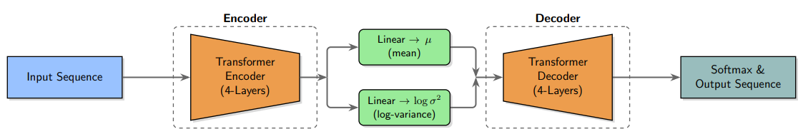

# ESMS-VAE

ESMS-VAE is a simple implementation of a Variational Autoencoder (VAE) for protein sequences. The notebooks use embeddings from the `fair-esm` package and demonstrate how to train and evaluate the model on a subset of the UniRef50 dataset.

## Structure

## Repository Contents

- `notebooks/esms-vae-structured.ipynb` – step-by-step training and evaluation workflow.
- `notebooks/gfp-cluster.ipynb` – example notebook for clustering latent vectors with `KMeans`.
- `notebooks/gfp-regressor.ipynb` – example notebook showing a regression task using latent features.
- `models/vae_epoch380.pt` – pretrained model checkpoint produced by the training notebook.
- `docs/ESMS_VAE.pdf` – short paper summarizing the method (also referenced below).

## Getting Started

1. Install dependencies (or use `requirements.txt`):
   ```bash
   pip install -r requirements.txt
   ```
2. Open `notebooks/esms-vae-structured.ipynb` in Jupyter and run the cells to download the data, train the VAE, and save a checkpoint.
3. To reuse the provided checkpoint, start from the **Load Saved VAE** section of the notebook.

The notebooks expect access to example datasets from Kaggle (e.g. `uniref50_subsample.fasta`). Adjust the paths in the notebooks if your data is stored elsewhere.

## Using the Notebooks

After training, you can explore the latent space with the clustering and regression notebooks. Each notebook assumes latent vectors have been generated by the main training notebook.

- `gfp-cluster.ipynb` clusters sequences using `KMeans`.
- `gfp-regressor.ipynb` fits a simple regression model to latent features.

## Pretrained Model

The file `models/vae_epoch380.pt` contains weights trained for 380 epochs. Load this checkpoint in the main notebook to reconstruct sequences or generate new examples.

## Library Usage Example

You can interact with the model programmatically using the `vae_module` package.
The snippet below demonstrates how to load the pretrained checkpoint and encode a sequence:

```python
from vae_module import Tokenizer, Config, load_vae, encode

cfg = Config(model_path="models/vae_epoch380.pt")
tokenizer = Tokenizer.from_esm()
model = load_vae(cfg, vocab_size=len(tokenizer.vocab),
                 pad_idx=tokenizer.pad_idx, bos_idx=tokenizer.bos_idx)

z = encode(model, "MKTFFVLLL", tokenizer, cfg.max_len)
```

The resulting tensor `z` contains the latent representation of the sequence.

For a more complete demonstration, see `usage_example.py` which
shows encoding and decoding sequences from the command line.

## Example Scripts

Several convenience scripts are included in the repository:

- `usage_example.py` – quick demo that loads the pretrained model and encodes a
  short sequence.
- `amino_acid_pca.py` – performs PCA on latent vectors from CSV files inside the
  `amino acids` directory and visualizes the result.
- `amino_acid_knn.py` – trains a KNN classifier on the same data and reports the
  test accuracy.
- `tm_gp_prediction.py` – predicts protein melting temperatures using VAE
  embeddings with a Gaussian Process regressor. Rows with missing sequences,
  characters outside the model vocabulary, or sequences longer than the
  configured maximum length are skipped.

Run any of these with Python to try them out, for example:

```bash
python usage_example.py
```

## Building Documentation

The `vae_module/docs` directory includes a minimal Sphinx configuration. After
installing the dependencies you can generate HTML documentation with:

```bash
sphinx-build -b html vae_module/docs docs/html
```

## ESMS VAE Paper

This repository includes the short paper [`ESMS_VAE.pdf`](docs/ESMS_VAE.pdf) titled
"ESMS VAE: A Structure-Informed Variational Autoencoder for Protein
Engineering". The paper proposes a custom loss that compares ESMS embeddings of
the original and reconstructed sequences, encouraging the model to encode
structural similarity. The composite loss is defined as

```
L = λ(LMSE + LCOS) + α · LCE + β · LKL
```

where `LCOS = 1 - COS(ESMS(origin), ESMS(recon))` and `LMSE =
MSE(ESMS(origin), ESMS(recon))`【F:docs/ESMS_VAE.pdf†L90-L101】.

Training on a UniRef50 subsample produced a model with a KL divergence close to
0.05 at epoch 380 and a reconstruction accuracy of **97.17%** on the test set
【F:docs/ESMS_VAE.pdf†L135-L140】. The same model achieved excellent downstream
performance on fluorescent proteins with a **0.987** 5-fold cross-validation
accuracy and regression RMSE values of **2.7** and **3.8&nbsp;nm** for absorption
and emission wavelengths, respectively【F:docs/ESMS_VAE.pdf†L12-L23】.

Refer to the PDF for figures, additional experiments, and references.

---

This repository is intended as a lightweight reference for experiments with protein VAEs and ESM embeddings. Feel free to adapt the notebooks for your own datasets or downstream tasks.
